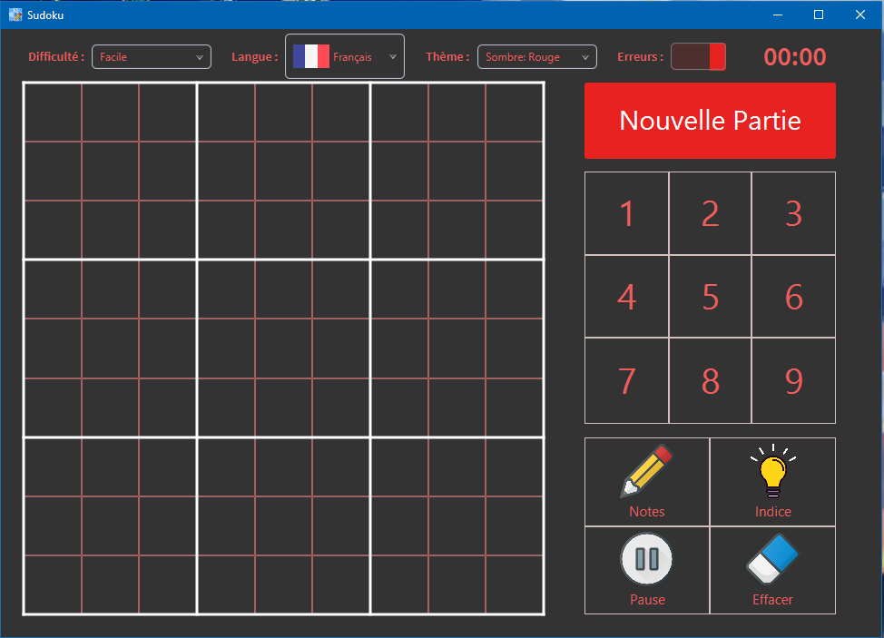
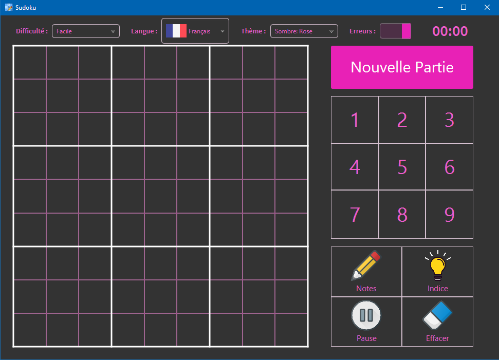

# Sudoku

This Sudoku application allows you to play your favorite game with an infinite number of grid available, each one automatically generated based on the difficulty chosen.

## Functionnalities

With this Sudoku application you can

* Generate difficulty based grid
* Chose your desired language
* Write little marks to help you remember each combinations
* Take a hint, filling one of your empty or erroneous cell
* Set the game in pause, pausing the timer
* Erase cells and marks
* Highlight the error you have made

 

## Keyboard shortcuts

* <kbd>1</kbd> - <kbd>9</kbd> and <kbd>Num 1</kbd> - <kbd>9</kbd> write the number in the current mode

* <kbd>CTRL</kbd> or <kbd>SHIFT</kbd> Toggle the marks

* <kbd>H</kbd> or <kbd>E</kbd> Give you a Hint

* <kbd>ENTER</kbd> or <kbd>P</kbd> Put the game in pause

* <kbd>BACKSPACE</kbd> or <kbd>DEL</kbd> toggle the Eraser

## Languages

* French (Default)
* English
* Spanish

And further more incoming.

## Difficulties

The difficulty is purely suggestive and based on the approximative cell number to complete. The more you have, the more difficult the grid is considered.

* Easy
* Medium
* Hard
* Very Hard

## Color themes
Multiple color themes are availables with both light and dark background.

### Background

* Light (Default)
* Dark

### Blue (Default)
 
### Green
 
### Red
 
### Orange
 
### Pink
 

## Credits
* Hint icon made by [Good-ware](https://www.flaticon.com/authors/good-ware)
* Eraser, Pencil and Pause icons made by [Those-icons](https://www.flaticon.com/authors/those-icons)
